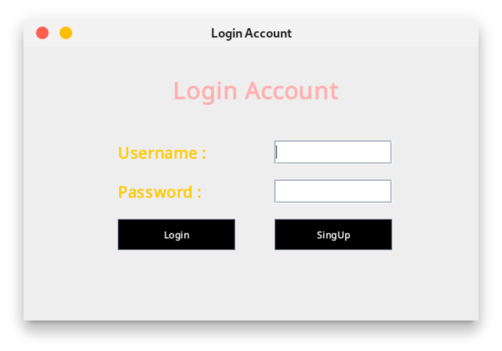
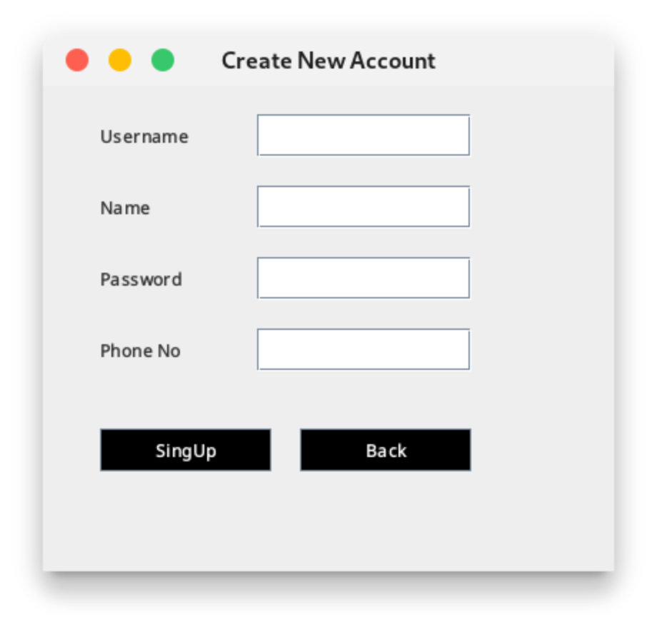
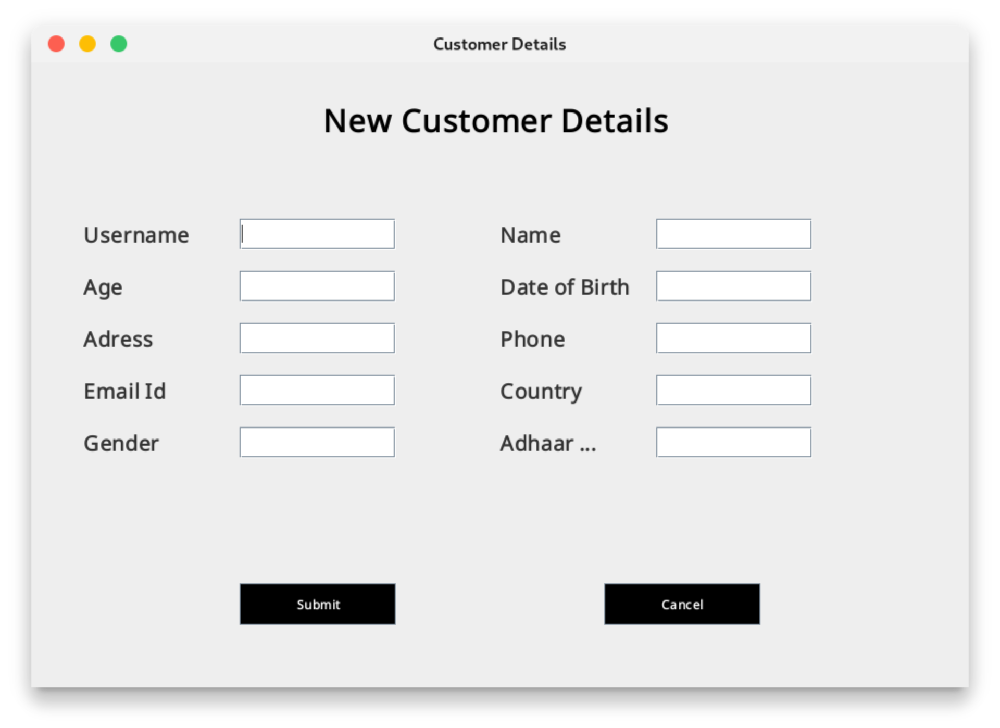

# Cab Rental Managment System (Java)

This is a simple cab rental management system implemented in Java. It's like having your own personal chauffeur, but in code form! The system allows users to book cabs, view available cabs, and view booking history. So, whether you're going on a fancy night out or just need a ride to the grocery store, this system has got you covered.

## Features
- Book cabs: Because hailing a cab on the street is so last decade.
- View available cabs: No more waiting around for a cab to magically appear.
- View booking history: Keep track of all your past adventures and misadventures.

## Technologies
- Java: The language that powers this virtual fleet of cabs.
- Jswing: The graphical interface that makes booking a cab a breeze.
- OOP: Object-Oriented Programming, the backbone of this system.
- MySQL: The database that stores all the important cab-related information.

## How to run
1. Clone the repository: Because you can't summon a cab without the code.
2. Open the project in an IDE: The virtual garage where all the magic happens.
3. Run the project: Sit back, relax, and watch as the cabs come to life.

## Screenshots

## License
This project is released under the MIT License. See [LICENSE](LICENSE) for details. Feel free to take this code for a joyride!
